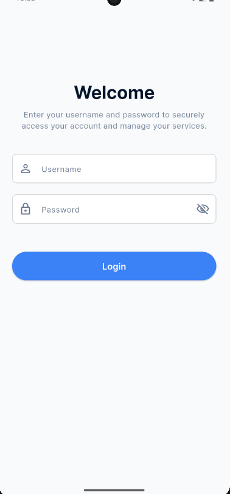
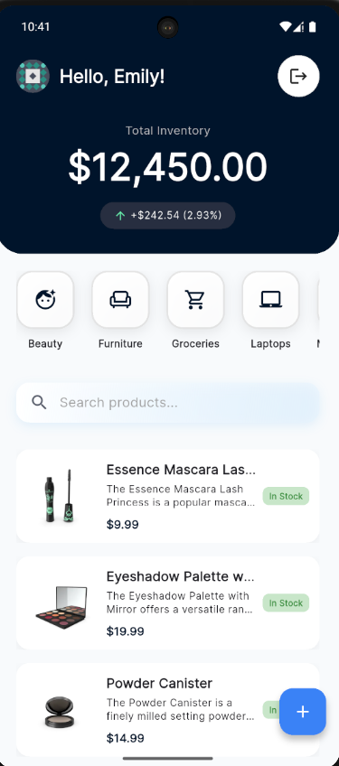
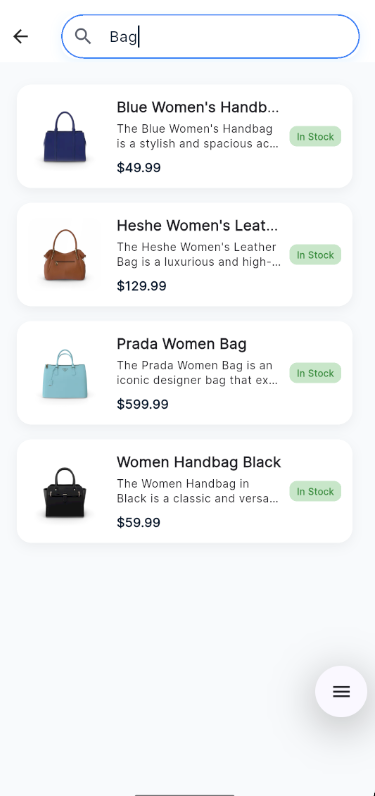
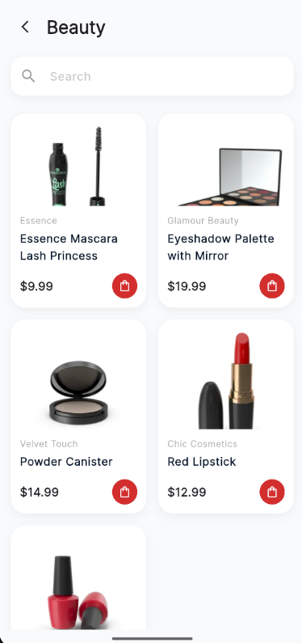
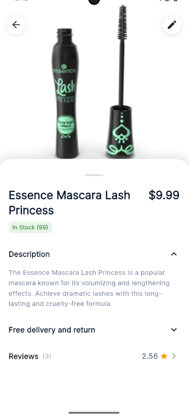
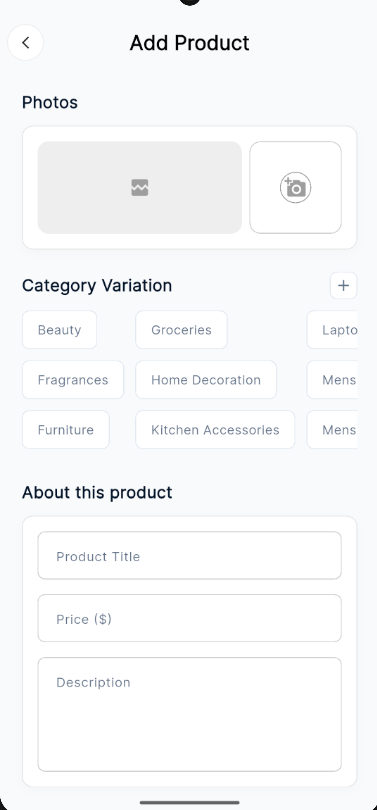
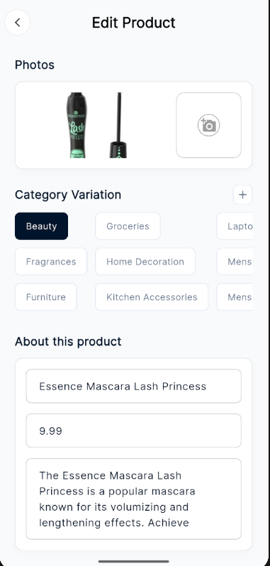
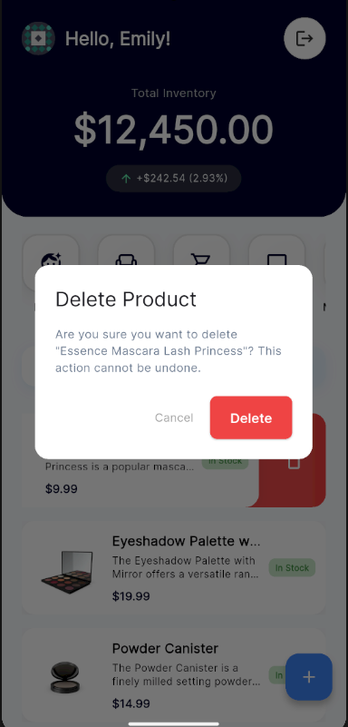

# StockPilot

StockPilot is a comprehensive inventory management mobile application built with Flutter. It streamlines product tracking, categorization, and management for modern businesses, featuring a sleek UI, robust inventory tools, and seamless data synchronization.

## App Overview

StockPilot offers a premium user experience for managing stocks. Key features include:

*   **Dashboard**: Real-time inventory statistics, total value tracking, and quick access to categories.
*   **Product Management**: Full Create, Read, Update, Delete (CRUD) capabilities with support for product images (Camera/Gallery).
*   **Categorization**: Organize products into categories with a dedicated Category view and in-page filtering.
*   **Search**: fast and responsive product search with debounce.
*   **Offline Mode**: Locally added products are persisted on the device, ensuring data availability even without an internet connection.

*   **Security**: Secure login authentication and logout functionality.

## API Reference

This application utilizes [DummyJSON](https://dummyjson.com/) as its backend data source.

*   **Source URL**: [https://dummyjson.com/](https://dummyjson.com/)
*   **Uses**:
    *   **Authentication**: User login validation.
    *   **Products**: Fetching product lists, details, and search results.
    *   **Categories**: Retrieving product categories.
    *   **Management**: Simulating product addition, updates, and deletion.

## Download

You can download the latest release APK here:
[Download app-release.apk](releases/app-release.apk)

## Setup Instructions

To get this project up and running on your local machine, follow these steps:

### Prerequisites

*   [Flutter SDK](https://docs.flutter.dev/get-started/install) (version 3.10.4 or higher)
*   Dart SDK (included with Flutter)
*   An IDE (VS Code or Android Studio) with Flutter plugins installed.

### Installation

1.  **Clone the repository:**
    ```bash
    git clone https://github.com/yourusername/stock_pilot.git
    cd stock_pilot
    ```

2.  **Install dependencies:**
    ```bash
    flutter pub get
    ```

3.  **Run the application:**
    *   Connect a physical device or start an emulator.
    *   Run the command:
        ```bash
        flutter run
        ```

## Login Credentials

Use the following credentials to log in to the application:

*   **Username**: `emilys`
*   **Password**: `emilyspass`

## Screenshots

### Application Flow

| Login | Home Dashboard | Search |
| :---: | :---: | :---: |
|  |  |  |

### Browsing & Details

| Categories | Product Details | Reviews |
| :---: | :---: | :---: |
|  |  |  |

### Product Management

| Add Product | Edit Product | Delete Confirmation |
| :---: | :---: | :---: |
|  |  |  |

## State Management Approach

This project utilizes the **BLoC (Business Logic Component)** pattern for state management, specifically leveraging the `flutter_bloc` package. This ensures a clear separation of concerns, making the app scalable, testable, and maintainable.

### Key Cubits/Blocs:

*   **`AuthBloc`**: Manages user authentication states (Login, Logout, Loading, Error).
*   **`HomeCubit`**: Handles the main dashboard state, fetching products and categories, and managing the local list updates.
*   **`CategoryProductCubit`**: Manages the state for the category detail screen, including fetching and filtering products within a specific category.
*   **`AddProductCubit`**: Handles the logic for adding and updating products, including API interaction and local simulation.
*   **`SearchCubit`**: Manages search queries with debouncing to optimize performance.

### Architecture

The app follows a clean architecture approach:
1.  **Presentation Layer**: UI Components (Screens, Widgets) that consume Bloc states.
2.  **Logic Layer (Bloc/Cubit)**: Business logic processing events and emitting states.
3.  **Data Layer**:
    *   **Repositories**: `ProductRepository`, `AuthRepository` - Act as a single source of truth, coordinating data from APIs and local storage.
    *   **Data Sources**: `ApiService` (Dio), `SharedPreferences` - Raw data access.
